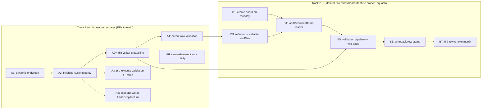

# Phase 1 — Manual Overrides System — Build Plan (version-of-record)

**Created:** 2026-05-02
**Refined:** 2026-05-02 via `/ultraplan` cloud review
**Branch:** `claude/beautiful-villani-8d84a8`
**Status:** Plan approved. Ready for execution.

**Purpose of this doc:** version-of-record for the Phase 1 build of the Manual Overrides System. Contains both source-of-truth monday.com docs in full, the current repo shape, and the refined build plan with sequencing, task-by-task estimates, and verification criteria. The strawman that was input to `/ultraplan` lives in git history at commit `d265bae`; this doc supersedes it.

**Execution venue:** desktop Claude Code, running in this worktree (`claude/beautiful-villani-8d84a8`). Do not attempt execution in `/ultraplan`'s cloud session — by design, /ultraplan is plan-in-cloud, execute-in-terminal.

---

## How to read this doc

1. Section A — **Source Document 1**: rolling handoff doc, full content. Most recent state at the bottom (Session log — 2026-05-02).
2. Section B — **Source Document 2**: design spec for the Manual Overrides System, full content. Phase 1 enhancements section at the bottom is highest-leverage for build sequencing.
3. Section C — **Current repo context**: file paths, function locations, commit state.
4. Section D — **Refined build plan**: post-/ultraplan version-of-record. Sequencing, decisions on the 8 open questions, prereqs and risks, ordered task list with effort estimates, verification.
5. Section E — **Triage notes**: things flagged during the Chris+Claude review of /ultraplan's output, captured here so they aren't lost in execution.
6. Section F — **Out of scope**: what NOT to do in Phase 1 (Phase 2/3/4 items). Confirmed correct by /ultraplan review.

---

## Section A — Source Document 1: Rolling Handoff Doc (object_id 18410512204)

> _⭐ START HERE — HTW Chat Handoff (2026-04-27 evening), with later session logs appended through 2026-05-02. Reproduced in full below._

# ⭐ START HERE — HTW Chat Handoff (2026-04-27 evening)

**Created:** 2026-04-27 evening, after execution session
**Replaces:** `18410278026` (4/25 evening handoff) — that doc's action items are now executed and can be considered closed
**Read order for next chat:** this doc top-to-bottom → then linked background docs as needed

---

### TL;DR

Friday 4/25's plan v12 is fully deployed. Both Harris-Tools commits (`7952b0b` BOB amend + `44bd998` planner cumulative-budget patch) are pushed to origin/main. Capacity view doc is clean (duplicate tables on 4/27 and 5/4 removed). Schedule for the next 8 weeks is in good shape.

**Cator Ruma firm delivery is Wednesday 4/29** — that's two days from this handoff, the only short-term operational pressure.

Three new institutional items captured tonight that need next-pass attention but aren't blockers: (1) skill gotcha #15 needs to be added to `capacity-view-refresh` via Claude.ai skills UI, (2) `update_doc` object_id-verification protocol, (3) skills-architecture gap (no source-of-truth for custom skills). All three are documented in the remaining-plan-items doc.

---

### Background Docs (read as needed)

| Doc | object_id | When to open it |
| --- | --- | --- |
| Remaining Plan Items |  | The canonical "what's queued, what's open, what's done" doc. Read this second after this handoff — it has full context on Bob onboarding, Manus retrospective, skill v2 gotchas, the new 4/27 entries (object_id incident + skills architecture gap), and Lead Time Calculator phases |
| Previous handoff (4/25 eve) |  | Background only — its action items are now executed. Don't re-execute anything in it. Useful for the BOB-on-4/27 correction reasoning if needed |
| HTW Live Capacity View |  | Live view of crew load by week. Currently clean as of 4/27. Refresh via `refresh the capacity view` (uses `capacity-view-refresh` skill) |
| Older general handoff |  | Long-term system architecture, board IDs, less time-sensitive. Reference only |
| Rebalance session record (4/24) |  | History — not action |

---

### What Changed Tonight (2026-04-27)

#### ✅ Harris-Tools repo: both commits pushed

- `7952b0b` (Friday meeting config) was amended via interactive rebase (`git rebase -i HEAD~2`, `edit` mode) to fix the BOB sub pool entry's `weekStart` from `2026-05-04` → `2026-04-27`. `44bd998` was cherry-picked back on top with a new SHA.
- `node scripts/rebalance-schedule.js --plan` verified after amend. Numbers match Friday expectations:
  - BOB sub: 4/27, 24h capacity (0 used — bookkeeping-only by design, Cator Panel work is on Edgeband-sub)
  - Spencer 4/27 = 35.15h ✓
  - Spencer 5/4 = 24.95h (lower than handoff's 28.9h estimate — the missing 3.95h is a planner re-route effect from PATCH 5, not a problem)
  - Jonathan 4/27 = 30.4/56h (56h is intentional weekend buffer for Cator coverage; left in place since it costs nothing)
  - Jonathan 5/4 = 27h ✓
  - Ken 4/27 = 24.8h ✓
  - Ken 5/4 = 42/40 🟡 (known Quince cascade, deferred)
  - Ian 5/11 = 18.05h ✓
  - Edge Optics Bench placed total = 49.9h ✓
- Both commits now on origin/main. Working tree clean.

#### ✅ Capacity View doc cleaned up

- Week 4/27: duplicate table removed earlier (only one table now, with BOB row, no marker).
- Week 5/4: duplicate table with leftover `❌ Subcontractor (BOB)` marker row was deleted manually in monday UI by Chris (after a doc-edit incident — see below).
- All weeks now show single clean tables.

#### ✅ Remaining plan items doc updated

Two new sections added at the bottom of `18410104836` under "Captured 2026-04-27 (evening session)":

- `update_doc` object_id verification protocol
- Skills architecture gap (no source-of-truth)

Plus the refined wording of skill gotcha #15 was added by the planning chat earlier in the day.

---

### What's Open (in priority order)

#### 1. Cator Ruma delivery — Wednesday 4/29 (firm)

The only operational item with short-term urgency. Plan covers it:

- Chris: P&S 2h + Deliver 2h on 4/29 (pinned)
- Edgeband-sub: Cator Panel 20h (off-board, must complete Mon–Tue)
- BOB sub pool: 24h on 4/27 (bookkeeping for Cator support, fully allocated)
- Ian: 8h Cator Panel head-start was on 4/24 (last week), already done
- Ken: 12h Cator Panel on 4/20 already done

If something slips Mon or Tue, that's the moment to flag it.

#### 2. Skill gotcha #15 — add to `capacity-view-refresh` via Claude.ai skills UI

Open Claude.ai → skills → `capacity-view-refresh` → append after gotcha #14 (current file already has #13 and #14 from the 4/25 session). Use this exact wording:

```
15. **Cosmetic marker leftovers after manual board edits.** When emoji
    markers (➕/✏️/❌) are added to crew rows in the capacity view doc
    AND the actual board changes are also applied separately (e.g.,
    during a meeting where Chris does both on the spot), the markers
    persist as cosmetic clutter after the next refresh — the diff finds
    nothing to sync because the board already matches. Clear them as
    part of the table replacement during refresh, not as a separate
    update step.
```

Match the indentation and style of #13/#14 (3-space indent, bold lead-in, wrapped prose).

#### 3. Quince → Ken 5/4 cascade (deferred)

Ken 5/4 still showing 42/40 🟡 in the dry-run plan. Same shape as the Edge Optics cascade fixed by PATCH 5, but for Quince Panel. Fix would be an explicit `customWindow.panel` for F&B Quince Ave pinning Panel to a single week. **Defer until next Friday's meeting** unless Ken 5/4 becomes critical mid-week.

#### 4. Skills architecture gap (institutional risk, not urgent)

Custom skills (`capacity-view-refresh`, `friday-shutdown`, `adapt-schedule`, `harris-drive`, `harris-project-board`) live only in Claude Desktop session cache (`AppData\Roaming\Claude\local-agent-mode-sessions\skills-plugin\...`). Not in any git repo. Editing surface is presumably Claude.ai web UI. Risk: AppData copy can be overwritten on sync; loss-of-work risk if Claude account/skills feature changes. Three options to evaluate (full detail in remaining-plan-items doc); recommended next step is a spike on whether Claude Desktop can be pointed at a custom skills directory.

#### 5. Bob onboarding — 5/18

Not yet active. Full checklist in remaining-plan-items doc. Includes: Command Center board, shutdown ritual training, removing Bob's subcontract overrides from `rebalance-overrides.json`.

---

### Skipped / Dropped

- **Manus AI Monday Briefing** — discontinued. Visualizer covers the use case for the Monday meeting. Don't restart the Python rewrite.

---

### Important Safety Reminders for Next Chat

These come from incidents tonight, not theoretical concerns. Read them.

#### `update_doc` object_id verification

When issuing any destructive `update_doc` call (`delete_block`, `replace_block`, etc.), state the target `object_id` explicitly in the response immediately before the tool call so Chris can sanity-check.

**Why this matters:** Block IDs are not globally unique across docs. The same UUID can exist in two different docs (likely from doc-template duplication or copy-paste). The `update_doc` API accepts the operation and confirms success without warning that the block was in a different doc than intended.

**Tonight's incident:** A `delete_block` was sent to the handoff doc instead of the capacity view because the same block ID happened to exist in both. Recovered via monday.com's version history (restoring point from earlier the same evening). Don't repeat this — verify object_id before every destructive call.

#### Don't act on stale block IDs

After any successful `update_doc` mutation, block IDs in your cached read of that doc are potentially stale. Re-read the doc (with `include_blocks: true`) before issuing more edits to the same doc.

#### `read_docs` block list truncation

`read_docs` with `include_blocks: true` returns the full markdown rendering but the `blocks` array can be truncated mid-doc. If you need block IDs from a section that didn't appear in the array, you may not have a way to retrieve them through the API. Falling back to having Chris do the edit in the monday UI is sometimes the safest play (this is what we did for the 5/4 capacity view duplicate cleanup tonight).

#### Skill files at `/mnt/skills/user/` are read-only

If a session asks for an edit to a custom skill, the answer is to edit via Claude.ai web UI, not via tool calls in-session. AppData mirror edits will likely be overwritten on next sync.

---

### Quick Reference — IDs

| Resource | ID |
| --- | --- |
| Workspace (Project Management) |  |
| Doc folder (handoffs/capacity view) |  |
| Master PM Board |  |
| Production Load Board |  |
| Weekly Crew Allocation parents |  |
| Weekly Crew Allocation subitems |  |
| Time Off Board |  |
| HTW Live Capacity View doc | object_id `18410103423` (doc_id `40914519`) |
| Remaining Plan Items doc | object_id `18410104836` (doc_id `40915139`) |
| Previous handoff (4/25 eve) | object_id `18410278026` |

---

### Suggested Opening for Next Chat

> Read this handoff doc (object_id of this doc) end to end. Then read the remaining-plan-items doc (
> 18410104836
> ) for full context. Then ask me what I want to work on.

(Chris's standard opening pattern. Works well.)

---

### Session log — 2026-04-28

Work done in this session, with current state for the next chat. **No new handoff doc created** — this section is the handoff. Read the rest of this doc above for full context.

#### What was done

1. **Skill gotcha #15 added.** Appended to `/mnt/skills/user/capacity-view-refresh/SKILL.md` via Claude.ai web UI. Open item #2 from the 4/27 handoff is now closed.
2. **Skills architecture gap → Option 3 (accept the risk).** Decision: keep editing custom skills via Claude.ai web UI, no backup, no source-of-truth in git. Treating skills as ephemeral. Risks acknowledged (no version control, AppData clobber risk, loss-of-work risk). Not pursuing periodic exports or making Harris-Tools the source-of-truth. Logged as RESOLVED in the remaining-plan-items doc (`18410104836`).
3. **Claude Handoff's folder cleanup.** Reviewed all 7 docs, consolidated redundancies:
   - **Section 13 added to Cross-Training Matrix doc** (`18410096815`): board IDs, crew → user ID mappings, display name mappings (for scripts), GraphQL API quirks (FormulaValue, BoardRelationValue, MirrorValue, reversed Date EXACT filter), and a pointer to the `docs/htw-production-system-handoff.md` repo file as source-of-truth. This was lifted from the Production System Handoff doc before archiving so the API quirks consolidation stays prominent.
   - **Archived (renamed + redirect stub at top of doc):**
     - `[ARCHIVED 2026-04-22] HTW Production System — Complete Handoff Doc` (`18409900525`)
     - `[ARCHIVED 2026-04-25] HTW Chat Handoff (2026-04-25 evening)` (`18410278026`)
     - `[ARCHIVED 2026-04-23] HTW Rebalance New Chat Handoff` (`18410096890`)
   - **Pending Chris's manual delete in monday UI:** the empty duplicate `🎯 HTW Cross-Training + Routing Matrix (Authoritative, 2026-04-23)` (`18410094194`). The non-empty version (`18410096815`) has all the content plus the new Section 13.

#### Folder state after cleanup

After Chris deletes the empty duplicate, the Claude Handoff's folder will contain 6 docs (table omitted; not relevant for Phase 1).

#### Open list for next chat (priority order)

1. **Cator Ruma delivery — Wednesday 4/29 (firm).**
2. **Quince → Ken 5/4 cascade.** Still deferred.
3. **Bob onboarding (2026-05-18).** Not yet active.
4. **Manual delete of empty matrix duplicate.**

---

### Session log update — 2026-04-28 (later)

Quick status pass on the open list from earlier today.

#### Closed

- ~~Cator Ruma delivery (Wed 4/29)~~ ✅ **On track.**
- ~~Manual delete of empty matrix duplicate (~~~~`18410094194`~~~~)~~ ✅ **Done in monday UI.**
- ~~Manus AI Monday Briefing — Python rewrite~~ ❌ **Not pursued.**

#### Open list — current state (priority order)

1. **Quince → Ken 5/4 cascade.** Still deferred.
2. **Bob onboarding (2026-05-18).** Not yet active.

No other operational items open. Schedule for the next 8 weeks remains in good shape per the 4/25 plan v12 deployment.

---

### Manual Overrides System — design spec linked

During this session, designed a system to move per-week schedule overrides from `rebalance-overrides.json` + Claude Code onto a monday.com board, with the planner becoming a self-running service. Goal: make manual tweaks fast, delegable to Bob/future production coordinator, and independent of Chris's machine + Claude chats.

**Full design spec:** object_id `18410674711` — _🛠️ HTW Manual Overrides System — Design Spec (2026-04-28)_ (reproduced in Section B below).

Design is complete and locked. Implementation hasn't started. Spec covers schema (14 columns, 2 groups), validation policy, dry-run-then-commit integrity model, run mechanics, outputs (Capacity View + new Weekly Briefing doc), and 4-phase build plan (local Task Scheduler first, cloud VPS later).

**Next session opener:** read the spec end-to-end, then start Phase 1 (create the Manual Overrides board + update the planner to read from it).

---

### Session log — 2026-04-28 (design session: Manual Overrides System)

Long design conversation. Producing this section so a fresh chat can pick up the project at Phase 1 with full context. **Read this section end-to-end before starting Phase 1; do not relitigate locked decisions.**

#### What was designed

A new system to replace the current Chris-edits-JSON-via-Claude-Code workflow for per-week schedule overrides. Goal: make manual tweaks fast, delegable to Bob (shop foreman, onboarding 5/18), and independent of Chris's machine + Claude chats. Full design spec in doc `18410674711`.

**One-paragraph summary:** A new **Manual Overrides board** on monday.com becomes the input surface for per-week schedule pinning. The planner reads from the board, validates each row, applies what's valid, flags what isn't, then writes Crew Allocation board + Capacity View doc + a new Weekly Briefing doc. Runs Saturday 6pm scheduled + on-demand button. Phase 1 = local Task Scheduler; Phase 4 = cloud VPS. Master PM Board stays the source-of-truth for delivery dates; override rows do NOT write to it. `rebalance-overrides.json` keeps structural config (sub pools, customWindows, capacity caps); per-week pinning leaves the JSON.

#### How the design conversation got here

Chris surfaced that manual tweaks are killing his time. Walked through what he was actually doing: editing overrides JSON (#1 most painful), the plan→visualizer→re-plan loop (#2 painful), verifying the result didn't cascade somewhere bad (#5 painful). The breakthrough was Chris reframing the goal: not "edit overrides faster" but "make this independent of me/my computer/Claude so I can delegate." That killed several options (CLI helpers, Claude-NL frontend) and pointed at a board-driven architecture. Walked four real recent override examples (MAG R5-P2 split, Ian→Spencer 5/4, Ken filler 5/4, Quince push) and discovered they all share one shape: "move N hours of (job × station) from (crew × week) → (crew × week)." That single primitive drove the whole schema.

#### Locked decisions — DO NOT relitigate

All resolved during the conversation. Captured here and in the spec.

**Architecture:**

- Master PM Board = source-of-truth for delivery commitments. Override rows do NOT write to it. External delivery-date changes (GC pushes a date) edit Master PM directly; planner picks up on next run.
- Manual Overrides Board = source-of-truth for "who does what work in which week."
- `rebalance-overrides.json` keeps structural config (sub pools, customWindow defs, capacity caps, time-off integration). Per-week pinning moves to the board.
- Crew Allocation board becomes a pure derived view, fully overwritten each run. No more direct subitem edits.
- Capacity View doc continues as rolling 8-week scanning surface; planner becomes the writer.
- Weekly Briefing doc is new — single-week printable for Monday meeting, same shape as a Capacity View week section.

**Override primitives:** one row type, vocabulary `(job × station × from_crew × from_week × to_crew × to_week × hours)`. Atomic moves, splits (multiple rows), pull-forwards, push-backs, swaps, pure assigns (empty From), pure clears (empty To) all expressed in this single shape.

**Within-week sequencing:** not in the system. Foreman's call.

**Filler discovery:** human, not automated. Chris/Bob picks the candidate from Master PM, then enters the row.

**Validation policy:**

- Cross-training matrix → **lenient** (system reference only, humans know who can do what)
- Master PM customWindow → **strict** (cannot pin past delivery date, Conflict)
- Consistency (does From-side hours actually exist in plan?) → **strict** (Conflict if not)
- Capacity → **lenient with checkbox** ("Allow Over-Cap" column overrides default rejection)

**Lifecycle:**

- Two groups: **Active** (working) and **Stale** (archive). Status values within Active: Pending / Applied / Conflict / Cleared.
- Auto-stale via monday native automation when row's relevant week is in the past.
- Recovery: drag from Stale back to Active.

**Run cadence:**

- Scheduled: Saturday 6pm Mountain (posts fresh plan + Capacity View + Weekly Briefing for Monday morning).
- On-demand: trigger surface on the board, polled every 60s by the planner script in Phase 1; webhook in Phase 4.

**Where it runs:** local Task Scheduler on Chris's machine for Phase 1; cloud VPS for Phase 4. Migration is mechanical.

**Outputs:** full overwrite of Crew Allocation each run; Capacity View regenerated rolling current+7 weeks (old weeks roll off, no archive); Weekly Briefing doc generated for upcoming week (single briefing now, room to add future weeks later); 🔧 indicator on Capacity View cells driven by an active override.

**Weekly Briefing priority order:** auto-scaffolded from delivery dates by the planner (date-ordered list). Humans rewrite at the meeting if more nuance is needed. This same scaffold also fills in placeholder priority blocks in the Capacity View.

**Integrity:** dry-run-then-commit. Planner computes new plan in memory, validates, then writes. If anything fails mid-write, leaves previous good state intact. Notification on conflicts/failures. Silent on success.

**Migration:** fresh start. No backfill of past forceAssignments. Existing JSON entries age out naturally over 4–6 weeks.

#### Schema — Manual Overrides board

14 columns, 2 groups. Full column-by-column detail in spec doc — see Section B below.

#### Build phasing

1. **Phase 1 — Manual Overrides board exists, planner reads it (no automation yet).**
2. **Phase 2 — Outputs automated.**
3. **Phase 3 — Run automation (local Task Scheduler).**
4. **Phase 4 — Cloud migration.**
5. **Phase 5 (optional) — QoL.**

Phase 1 is the next session. Bounded, doesn't touch outputs yet, proves schema before automation.

#### Open implementation questions (NOT design questions)

These don't block Phase 1 design but need answers during the build:

1. **Cross-training entry-time filter feasibility.** Confirm during Phase 1 whether monday's dropdown supports conditional filtering driven by another column. Locked decision was "build if supported, skip if not."
2. **Atomicity of Crew Allocation overwrite.** GraphQL `change_multiple_column_values` per item, or item-by-item with rollback logic? Settle during Phase 1.
3. **On-demand trigger surface.** Button column vs. dedicated trigger item. Probably trigger item for Phase 1 (simpler polling), button column when we move to webhooks in Phase 4.
4. **Notification channel.** Email default unless clear Slack/bell preference emerges.

#### Things this resolves or changes

- Replaces the discontinued Manus AI Monday Briefing concept.
- `capacity-view-refresh` skill stops being the daily refresh path after Phase 2. Stays for emergencies.
- Direct edits to Crew Allocation subitems stop being a valid workflow after Phase 1 ships and outputs are wired in Phase 2.
- Per-week pinning leaves `rebalance-overrides.json`. Structural config stays.

---

### Session log — 2026-05-02 (rebalance + Phase 1 enhancements captured)

Long session. Two outcomes worth carrying forward: (1) a clean iter-8 production schedule is live on monday with operationally-correct finishing cycles, and (2) the Manual Overrides spec doc (`18410674711`) now has a documented Phase 1 enhancements section capturing 7 issues surfaced tonight that should be folded into the build.

**Read the spec doc, not this section, for what to build.** This section is for context — pointers and things to know before starting work in Claude Code.

#### Where to do Phase 1 work — Claude Code, not chat

Phase 1 is a code change to `rebalance-schedule.js` plus possibly new validation utilities in the Harris-Tools repo. Right venue:

- **Claude Code on desktop** for all script changes, repo-level work, and Phase 1 build-out. Sees the full file, runs tests inline, iterates fast.
- **Chat (future sessions)** for rebalance decisions, override file changes, schedule validation, communication drafting, real-time monday board manipulation.

Don't try to do Phase 1 in chat. The diffs get unwieldy and there's no test loop.

#### What was added to the spec doc tonight

Section "Phase 1 enhancements — captured 2026-05-02" added to `18410674711`. 7 items, in priority order (full text in Section B below):

1. **Finishing cycle integrity in `computeWindows()`** (highest leverage).
2. **Pre-execute validation step.**
3. **Stale subitem cleanup utility.**
4. **Auto-create missing crew parent rows.**
5. **Executor writes Finish Drop / Finish Return back to Production Load Board.**
6. **Column naming clarity** (low priority polish).
7. **Dynamic planning horizon.**

The spec doc is the source-of-truth for Phase 1 scope. Don't re-derive these from chat history; they're already written up there with full context.

#### Tonight's iter-8 rebalance — current schedule state

For situational awareness, not re-execution:

- **84 placements live on Crew Allocation board** through 8/03 (Atom Computing tail).
- **Master PM delivery date updates pushed:** Quince 5/26 → 5/29 Fri; Liz Stapp 6/01 → 6/03 Wed; SHI Huntington 6/01 → 6/03 Wed. McMorris stays 6/19.
- **Production Load Board Finish Drop / Return columns updated** for all 5 non-pLam jobs (Gilbert, Quince, Liz Stapp, SHI, McMorris). pLam jobs cleared (R5-P1, BCH, R5-P2 CU, Edge Optics, SciTech, Atom).
- **Two warnings accepted:** Bob 5/04 25.9/24 (Edge Optics squeeze, planned); Bob 5/25 48.2/40 (Memorial Day stretch — R5-P1 + SciTech + Quince Post-Fin all converging).
- **Single sub used:** BCH-Bench-sub 19.95h on 5/11.
- **Email to Clay (finisher) drafted** with 5-job schedule + delivery date shifts.

#### Schedule visuals — new convention

Drive folder created tonight: **`Production Scheduling > Schedule Visuals`** (folder ID `1d2U75nioR2-FySF-m_qO7V0or9hh1Hxq`, parent `1BIV_y2rrStR1zwYh7cJRk9oyagHFhXvX`).

Convention: after every `--execute`, the visual is generated as `htw-schedule-latest.html` (always current) + `htw-schedule-YYYY-MM-DD.html` (dated history). Drag both into the Drive folder. Phase 2 of the Manual Overrides build should automate this Drive upload (planner writes the visual after `--execute`).

**The harris-drive skill should be updated** with this new folder reference at next opportunity (skill is at `/mnt/skills/user/harris-drive/SKILL.md`, edit via Claude.ai web UI).

#### Capacity View doc — stale, deferred

Live Capacity View doc (`18410103423`) was NOT refreshed tonight. Reason: skill is designed for incremental Friday-meeting updates, not full rebuilds, and the doc hits the 25-block read limit during massive replacements. Iter-8 visual artifact is the better surface for tomorrow's production meeting. Refresh the doc at this Friday's Shutdown ritual or whenever it serves a purpose.

#### Status when this session ended

- Iter-8 schedule live on monday, all dates correct, both Master PM and Production Load Board reconciled.
- Phase 1 enhancements documented in spec doc `18410674711`.
- Drive folder created for schedule visuals.
- Email to Clay queued for Chris to send.
- Phase 1 build NOT started.
- Capacity View doc (`18410103423`) is stale relative to iter-8 — defer refresh to Friday Shutdown or as needed.

---

## Section B — Source Document 2: Design Spec (object_id 18410674711)

> _🛠️ HTW Manual Overrides System — Design Spec (2026-04-28). Reproduced in full below._

# HTW Manual Overrides System — Design Spec

**Created:** 2026-04-28 (design conversation, Chris + Claude)
**Status:** Design complete. Implementation not started.
**Goal:** Make manual schedule adjustments fast and self-contained. Move per-week pinning out of `rebalance-overrides.json` and Claude Code, onto a monday.com board that a non-Chris operator (Bob, future production coordinator) can run.

---

### TL;DR

Today, manual schedule tweaks route through Chris → Claude → Claude Code → JSON edit → `--plan` → visualizer → `--execute`. Slow, requires Chris specifically, requires technical knowledge.

The new system: a **Manual Overrides board** on monday.com is the input surface. The planner reads it, validates each row, applies what's valid, flags what isn't, and writes results back to the Crew Allocation board, the Capacity View doc, and a new Weekly Briefing doc. Runs on a schedule (Saturday 6pm) and on-demand (button). All edits route through monday.com — Claude is no longer in the loop.

Architecture:

- **Master PM Board** = source-of-truth for delivery commitments (delivery dates, finishing milestones)
- **Manual Overrides board** (new) = source-of-truth for "who does what work in which week"
- **`rebalance-overrides.json`** = stays for structural config (subcontractor pools, customWindows, capacity caps)
- **Crew Allocation board** = pure derived view, fully overwritten by the planner each run
- **Capacity View doc** = output, refreshed by the planner each run
- **Weekly Briefing doc** (new) = single-week printable, output of the planner

---

### Design decisions — locked

Each decision below is a question we already answered in the design conversation. Captured here so the implementation phase doesn't relitigate them.

#### Override primitives

- **Vocabulary:** one row type. `(job × station × from_crew × from_week × to_crew × to_week × hours)`. Atomic moves, splits (multiple rows), pull-forwards, push-backs, crew swaps, pure assigns (empty From), pure clears (empty To) all expressed in this single shape.
- **Within-week sequencing:** not in the system. Foreman's call.
- **Filler discovery:** human, not automated. Chris/Bob picks the candidate from Master PM, then enters the row.

#### Validation policy

- **Cross-training matrix:** lenient. Matrix is system reference, not a hard gate. Humans know who can do what.
- **Master PM customWindow:** strict. Cannot pin past delivery date. Conflict.
- **Consistency:** strict. From-side hours must actually exist in the current plan. Conflict if not.
- **Capacity:** lenient with checkbox. Default rejects rows that push crew over weekly cap. "Allow Over-Cap" checkbox column overrides.

#### Lifecycle

- **Two groups:** Active and Stale.
- **Status values within Active:** Pending / Applied / Conflict / Cleared.
- **Auto-stale:** when a row's relevant week is in the past, monday automation moves the row to Stale group.
- **Recovery:** drag from Stale back to Active to revive an override.

#### Run cadence

- **Scheduled:** Saturday 6pm. Posts a fresh plan + Capacity View + Weekly Briefing for Monday morning.
- **On-demand:** button on the Manual Overrides board, polled every 60s by the planner script.

#### Where it runs

- **Phase 1:** local Task Scheduler on Chris's machine. Same place the existing rollups live.
- **Phase 2 (later):** cloud VPS so the system survives Chris's machine crashing/sleeping. Migration is mechanical.

#### Outputs

- **Crew Allocation board:** fully overwritten on each run. No more direct edits to subitems.
- **Capacity View doc:** fully regenerated on each run. Rolling window of current week + 7 future weeks. Old weeks roll off naturally (no archive — git history of planner output JSON is the audit trail).
- **🔧 indicator:** cells driven by an active override show a wrench emoji in the Capacity View.
- **Weekly Briefing doc:** new doc, name = "📋 HTW Weekly Briefing — Week of [Monday date]". Single-week shape: top notes (deliveries/finish drops), crew table (same shape as Capacity View week section), priority order with auto-scaffolded date-ordered list. One briefing for the upcoming week; future-week expansion is room-for-later.

#### Integrity

- **Dry-run-then-commit:** planner computes the entire new plan in memory, validates, then writes. If anything fails mid-write, leaves the previous good state intact. Surfaces the error in a notification. Bob retries or escalates.

#### Migration

- **Fresh start.** No backfill of past forceAssignments from `rebalance-overrides.json`. Existing JSON entries age out naturally over 4–6 weeks as their weeks pass.
- **Structural config stays in JSON:** subcontractor pools, customWindow definitions, capacity caps, time-off integration. Per-week pinning moves to the board.

---

### Manual Overrides board — schema

**Groups:**

- **Active** — working group. New rows land here. Planner reads from here.
- **Stale** — historical archive. Auto-populated when a row's week passes.

**Columns:**

| # | Column | Type | Notes |
| --- | --- | --- | --- |
| 1 | Override Name | item name | Auto-generated, human-readable. e.g. "Move 20h MAG R5-P2 CU: Jonathan 4/27 → Jonathan 5/4" |
| 2 | Job | board_relation → Master PM | Picks a real job. Validates existence. |
| 3 | Station | dropdown | Eng / Panel / Bench / Post Fin / P&S / Deliver / Field |
| 4 | From Crew | board_relation → Crew Allocation parents | Empty = pure assign |
| 5 | From Week | date (Monday-of) | Empty when From Crew empty |
| 6 | To Crew | board_relation → Crew Allocation parents | Empty = pure clear |
| 7 | To Week | date (Monday-of) | Empty when To Crew empty |
| 8 | Hours | numbers | Hours of (Job × Station) being moved |
| 9 | Status | status | Pending / Applied / Conflict / Cleared |
| 10 | Conflict Reason | long_text | Planner-populated when Status=Conflict |
| 11 | Reason | text | Human-entered intent. ("Ian in field for punchlist") |
| 12 | Created By | people | Audit trail |
| 13 | Last Run | date | When planner last evaluated this row |
| 14 | Allow Over-Cap | checkbox | If checked, planner accepts even when To Crew goes over weekly cap |

**Native automations:**

1. When Status changes to "Applied" or "Cleared" AND From/To Week is in the past → move row to Stale group.
2. When today > To Week (or From Week if no destination) AND Status is still "Pending" → move to Stale group, flip Status to "Cleared (auto)".

**Open implementation question:** the entry-time cross-training filter (Question B from design conversation). Locked decision was "filter at entry if monday.com supports it." Confirm during implementation whether the To Crew dropdown can be conditionally filtered by Station selection. If supported, build it. If not, skip and rely on the planner-read consistency check.

---

### Planner read-and-reconcile loop

This is the load-bearing piece. On each run:

#### Step 1 — Read

- Read all rows in Active group of Manual Overrides board.
- Read structural config from `rebalance-overrides.json`.
- Read current state of Master PM Board (delivery dates, customWindows).
- Read time-off, capacity, cross-training matrix.

#### Step 2 — Validate each override row

For each row in Active group with Status=Pending:

- **Master PM customWindow check (strict):** is To Week within the job's customWindow given the current delivery date? If not → Status=Conflict, Conflict Reason="To Week 5/18 is past delivery date 5/15 for Quince Ave".
- **Consistency check (strict):** does From Crew × From Week × Station × Hours correspond to actually-allocated hours in the current plan? If not → Status=Conflict, Conflict Reason="No 8h Bench hours found for Ian in week 5/4 — current allocation shows 6h".
- **Capacity check:** would To Crew go over their weekly cap with this row applied? If yes AND Allow Over-Cap is unchecked → Status=Conflict, Conflict Reason="Puts Spencer at 44h, cap is 40h. Tick Allow Over-Cap to apply anyway." If yes AND checked, accept with soft warning logged.
- Row passes all checks → Status=Applied (mark for application; actual board write happens after dry-run).

#### Step 3 — Build new plan in memory

- Translate each Applied row into an internal forceAssignment.
- Run the planner end-to-end with these forceAssignments + structural config.
- Compute the diff against current Crew Allocation board state.
- If the planner itself errors (cycle, infeasibility, etc.) → abort, preserve previous good state, raise notification.

#### Step 4 — Commit (only if dry-run succeeded)

In strict order:

1. Write Crew Allocation board (full overwrite, atomic where possible).
2. Generate Capacity View doc body (current week + 7 future, with 🔧 on overridden cells) and replace the doc.
3. Generate Weekly Briefing doc body (upcoming week only) and replace the doc.
4. Update Manual Overrides board: flip Status to Applied for accepted rows, Conflict for rejected rows, populate Last Run timestamp.

**Failure handling between steps:** if step 1 succeeds but step 2 fails, we have a Crew Allocation that doesn't match its Capacity View. Logged loudly. Notification surfaces "Crew Allocation written but Capacity View refresh failed — re-run on-demand or call Chris."

#### Step 5 — Notify

- If anything was rejected (any Conflict in this run) → notification listing the affected rows with reasons.
- If the run failed mid-commit → notification with the failed step.
- If everything succeeded → silent (no spam).

**Notification channel — open question:** email to Chris? Slack channel? Bell on monday.com? Defer until implementation phase. Default to email until a real preference shows up.

---

### Run mechanics

#### Phase 1 — local Task Scheduler

- **Scheduled run:** Windows Task Scheduler task `HTW Planner — Saturday`, fires Saturday 6pm Mountain. Runs `node scripts/run-planner.js` (new entry-point script wrapping the existing rebalancer).
- **On-demand run:** Task Scheduler task `HTW Planner — Poll`, fires every 60s. Reads a designated "Run Trigger" item on the Manual Overrides board (or a dedicated single-row trigger board). If status is "Run Requested," kicks off the planner and flips status to "Running" → "Idle" when done.
- **Logs:** `C:\Users\chris\Harris-Tools\logs\planner-YYYY-MM-DD.log`. Same pattern as existing rollups.
- **Failure mode if Chris's machine is asleep:** the run doesn't happen until the machine wakes. Acceptable for Phase 1.

#### Phase 2 — cloud (later)

- Cheap VPS ($6–12/mo, DigitalOcean/Hetzner/Linode).
- Same script, scheduled via cron on the server.
- monday.com Button column fires a webhook directly to the server (no more polling).
- Secrets: monday API token in environment variables, not a `.token` file.
- Code lives in git, server pulls latest on each run.
- Logs shipped to a Drive folder or tail-able from the server.

---

### What goes away

- **`rebalance-overrides.json`** **per-week pinning.** Move to the board.
- **Manual `--plan` and `--execute` Claude Code runs for tweaks.** Replaced by board edits + on-demand button.
- **`capacity-view-refresh` skill as the daily refresh path.** Planner becomes the writer. Skill stays for emergency manual edits but isn't the normal flow.
- **Direct edits to Crew Allocation subitems.** Crew Allocation is now a derived view. All edits route through Manual Overrides board.

### What stays

- **`rebalance-overrides.json` structural config:** subcontractor pools, customWindow definitions, capacity caps, time-off integration.
- **Master PM Board** as source-of-truth for delivery dates. External delivery-date changes (GC pushes a date) edit Master PM, not the override board. Planner picks up the change on next run.
- **Existing planner logic** in `rebalance-schedule.js`. The new entry-point `run-planner.js` wraps it; the planner internals are unchanged.

---

### Phasing

This is a multi-weekend build. Phasing chosen so each phase is independently usable.

#### Phase 1 — Manual Overrides board exists, planner reads it (no automation yet)

- Create the board with all 14 columns and 2 groups.
- Configure native automations (status → group transitions).
- Update `run-planner.js` to read the board alongside `rebalance-overrides.json`.
- Add the validation pipeline (Master PM, consistency, capacity).
- Test: enter a few rows manually, run the planner manually, verify the right rows apply and the right rows flag Conflict.
- **End-state:** the override board works end-to-end but Chris is still triggering runs from Claude Code. Schema is proven.

#### Phase 2 — Outputs (Capacity View + Weekly Briefing automated)

- Planner generates the Capacity View doc body and replaces the doc.
- Planner generates the Weekly Briefing doc.
- 🔧 indicator on overridden cells.
- Auto-scaffolded priority order in Weekly Briefing.
- **End-state:** outputs flow automatically. `capacity-view-refresh` skill is no longer needed for the daily path.

#### Phase 3 — Run automation (Saturday scheduled + on-demand polling)

- Task Scheduler tasks for Saturday 6pm and 60s polling.
- On-demand trigger surface on the board (button or status column).
- Logging + notifications wired up.
- **End-state:** Bob can run the system without Chris. Local Task Scheduler.

#### Phase 4 — Cloud migration

- Spin up VPS.
- Deploy script + cron.
- Switch on-demand from polling to webhook (button → server).
- Decommission Task Scheduler tasks on Chris's machine.
- **End-state:** system survives Chris's machine being off.

#### Phase 5 (optional, later) — quality-of-life

- Future-week briefings.
- Better notification surfaces if email is too noisy.
- Cross-training entry-time filter if monday.com supports it and we skipped in Phase 1.

---

### Risks and mitigations

| Risk | Likelihood | Mitigation |
| --- | --- | --- |
| Schema is wrong and we redo the board | Medium | Schema fully designed before any code. If wrong, we eat the redo — but the migration is cheap because Phase 1 is small. |
| Planner crashes mid-write, board state corrupted | Medium-high | Dry-run-then-commit pattern is non-negotiable. Logged loudly, previous state preserved on any failure. |
| Bob enters something the validator should catch but doesn't | Medium | Three strict checks (Master PM, consistency, capacity-without-checkbox). Conflict surfacing is loud. Wrong rows don't apply silently. |
| Chris's machine is asleep at Saturday 6pm in Phase 1 | Low-medium | Acceptable for Phase 1. Phase 4 (cloud) is the real fix. |
| Notification volume is too high | Low | Default to silence-on-success. Only notify on conflicts/failures. Tune in Phase 3. |
| Override board accumulates dead rows in Active despite automation | Low | Auto-stale automation handles week-passing. If Status-driven automation misfires, periodic manual cleanup is fine. |
| `rebalance-overrides.json` structural config drifts out of sync with board | Low | Both feed the planner via the same `run-planner.js`. Drift would manifest as Conflict rows, surfaced clearly. |

---

### Open implementation questions

These didn't need design-time answers but do need answers during the build:

1. **Cross-training entry-time filter feasibility.** Confirm whether monday.com's dropdown supports conditional filtering driven by another column.
2. **Atomicity of Crew Allocation overwrite.** What's the right batched-write API path on monday.com? GraphQL `change_multiple_column_values` per item, or item-by-item with rollback logic? Settle during Phase 1.
3. **On-demand trigger surface.** Button column vs. dedicated trigger item with a status column.
4. **Notification channel.** Email default unless a clear Slack/bell preference emerges.
5. **Single-row "trigger" item vs. board-level button.** Mostly a UX preference; the polling logic doesn't care. Decide in Phase 3.

---

### Phase 1 enhancements — captured 2026-05-02

These are issues surfaced during the 2026-05-02 rebalance session (8 plan iterations to ship a clean week-of-5/4 schedule). They belong in the Phase 1 build — fix them when the planner gets restructured, rather than letting them keep showing up in every rebalance.

#### 1. Finishing cycle integrity (highest priority)

**The bug:** `computeWindows()` in `rebalance-schedule.js` does not enforce that Pre-Fin completes before Finish Drop, or that Finish Return arrives before Post-Fin starts. For non-pLam jobs with `finishingDays > 0`, the script can produce schedules where Pre-Fin and Post-Fin land in the same week — leaving zero days for the finisher.

**Tonight's manifestation:** Quince, Liz Stapp, SHI Huntington, and McMorris all required hand-built `customWindow` overrides to force operationally-valid sequencing. Took 3 extra plan iterations and required pushing 3 delivery dates (Quince, Liz Stapp, SHI) to make the cycles fit.

**The fix:** in `computeWindows()`, the Pre-Fin window must end at least `finishingDays` business days before Post-Fin window starts. Specifically the Pre-Fin end target should be `addBusinessDays(finishDrop, -1)` not `addDays(deliveryWeek, -3)`. ~5 line change. Add an assertion that catches the constraint at compute time.

#### 2. Pre-execute validation step

**The bug:** `--plan` outputs a capacity grid and warning list, but does not validate that the plan is operationally executable. Tonight, the iter 7 plan committed to monday before we caught that finishing cycles were broken — required a second `--execute` to fix.

**The fix:** add a `=== FINISHING CYCLE VALIDATION ===` section to `--plan` output. For each non-pLam job: report Pre-Fin end week, finishingDays, Post-Fin start week, computed gap. Show ✓ if gap ≥ finishingDays, ❌ if not. If any ❌, `--execute` refuses to run unless `--force` flag passed. This is a purely-additive output change; no logic change required.

Secondary check while we're at it: validate that all Bob placements in `forceAssignments` and auto-routing have a Crew Allocation parent row. Tonight two Bob forces silently skipped because parent rows for 5/04 and 5/11 hadn't been created.

#### 3. Stale subitem cleanup

**The bug:** completed jobs leave subitems on Crew Allocation parent rows. Ian's 5/04 parent showed 12.6h committed from F&B Westridge subitems — a job marked Complete weeks ago. PATCH A in the script preserves these because the job's not in the active set, but they pollute capacity grid output and create false 🚨 overage warnings.

**The fix:** add a one-time cleanup utility (`scripts/clean-stale-subitems.js`) that finds subitems whose linked Master PM job has Status = Complete, lists them, and prompts before deleting. Could be run as part of the Friday Shutdown ritual or weekly automation.

#### 4. Auto-create missing crew parent rows

**The bug:** `BOB_START_DATE` change required manually creating Bob's parent rows for week of 5/04 and 5/11 on the Crew Allocation board before forces would land. Without those rows, forces silently skipped with `forceAssignment skipped: Bob has no allocation parent row`.

**The fix:** at the start of `--plan`, validate that every (crew × week) combination in the planning horizon has a parent row. If missing, either (a) auto-create them or (b) fail loudly with a clear list of what to create manually. Auto-creation is preferred since it's 1 mutation per missing row.

#### 5. Executor writes Finish Drop / Finish Return back to Production Load Board

**The bug:** `computeWindows()` computes `finishDrop` and `finishReturn` dates in memory, but the executor only writes Crew Allocation subitems. Production Load Board's `date_mm26qqv3` (Finish Drop) and `date_mm2k17ef` (Finish Return) columns stay stale until manually updated.

Tonight required a separate hand-update pass to fix these for 5 jobs after `--execute`. Easy to forget, easy to leave wrong.

**The fix:** in the executor, after creating subitems, write the computed `finishDrop` and `finishReturn` dates back to the Production Load Board for each active job. For pLam jobs, clear those columns (set to null) since there's no finish cycle.

#### 6. Column naming clarity on Production Load Board

**The bug:** the column `date_mm2k17ef` is titled "Finish Return Date" but its short name and proximity to delivery-related columns made it easy to confuse with delivery date. Tonight I overwrote it with delivery values for Gilbert and SHI before catching the mistake.

**The fix (low priority):** consider renaming columns for clarity. "Finish Return Date" → "Finishing — Pickup Date". "Finish Drop Date" → "Finishing — Drop Date". Group them visually under a Finishing column group if monday.com supports that. Optional polish, not blocking.

#### 7. Planning horizon should be dynamic, not hardcoded

**The bug:** `const endWeek = '2026-07-27'` was hardcoded. Required a script edit to extend horizon for Atom Computing's 8/08 delivery. Anyone running the planner needs to remember to extend this when a job has a far-future delivery.

**The fix:** compute `endWeek` dynamically as `max(deliveryDates) + 4 weeks` across all active jobs. Removes the manual maintenance burden entirely.

---

## Section C — Current repo context

**Branch:** `claude/beautiful-villani-8d84a8` (worktree off main, clean)
**Repo:** `Harris-Tools`
**Most recent commit:** `e9b5717 fix: PATCH 5 cumulative-budget tracking in scheduleStation`

### Files in scope

- [scripts/rebalance-schedule.js](scripts/rebalance-schedule.js) — 1,319 lines. Single-file planner, currently CLI-invoked with `--plan` or `--execute`.
- [config/rebalance-overrides.json](config/rebalance-overrides.json) — 231 lines. Structural config + per-week pinning.
- [scripts/generate-crew-allocation-items.js](scripts/generate-crew-allocation-items.js) — sibling utility.
- [scripts/rollup-cc-non-production.js](scripts/rollup-cc-non-production.js), [scripts/rollup-time-off.js](scripts/rollup-time-off.js) — existing scheduled scripts (precedent for Task Scheduler integration in Phase 3).
- [scripts/validate-cross-training.js](scripts/validate-cross-training.js) — existing validator (precedent for the new validation pipeline).
- [docs/htw-cross-training-matrix.md](docs/htw-cross-training-matrix.md) — system reference, Section 13 has board IDs, crew → user ID mappings, GraphQL quirks.
- [docs/htw-production-system-handoff.md](docs/htw-production-system-handoff.md) — repo-side source-of-truth handoff. Worth scanning for additional architectural notes.

### Key locations inside `rebalance-schedule.js`

| Symbol | Line | Notes |
| --- | --- | --- |
| Mode flag (`--execute` vs `--plan`) | 30 | `MODE = process.argv.includes('--execute') ? 'execute' : 'plan'` |
| `OVERRIDES_PATH` | 36 | Where overrides JSON loads from |
| Board IDs (PL / Master PM / Crew Alloc / Subitems / Time Off) | 56–60 | Centralized constants |
| `BOARD_PL`, `COL_PL.finishDrop` (`date_mm26qqv3`), `COL_PL.finishReturn` (`date_mm2k17ef`) | 57, 79–80 | Production Load board column refs (target for fix #5) |
| `BOB_START_DATE` | 149 | Currently `'2026-05-18'` |
| `getForceAssignments(jobId, station, week)` | 703 | The current per-week pinning surface (target for board read in Phase 1) |
| `applyForceAssignments(grid, job, station, week, weekHours)` | 717 | Where forces land in the grid |
| `computeWindows(job)` | 774 | Target for fix #1 (finishing cycle integrity) |
| `finishDrop`/`finishReturn` computed | 803–810 | Currently in-memory only; target for fix #5 |
| Pre-Fin window logic | 820–841 | Target for fix #1 |
| `scheduleStation` | 948 | PATCH 5 cumulative budget (recent fix) |
| `plan()` | 1059 | Plan-mode entry; target for validation step (#2) and dynamic horizon (#7) |
| `endWeek` hardcoded | 1087 | `'2026-07-27'` — target for fix #7 |
| `execute()` | 1243 | Executor; target for fix #5 (write back finish dates) |

### What runs today

- `node scripts/rebalance-schedule.js --plan` — dry-run, prints capacity grid, warnings, force-skips.
- `node scripts/rebalance-schedule.js --execute` — writes Crew Allocation subitems to monday.

### What's NOT in the repo yet

- `scripts/run-planner.js` — new entry-point wrapper called for in spec.
- `scripts/clean-stale-subitems.js` — new utility for fix #3.
- Any code that reads from a Manual Overrides board (board doesn't exist yet either).

---

## Section D — Refined build plan (post-/ultraplan, version-of-record)

### D.0 Context

The current schedule-rebalance workflow routes every per-week tweak through Chris → Claude → Claude Code → JSON edit → `--plan` → visualizer → `--execute`. Slow, single-operator, untestable mid-week. The locked design moves per-week pinning onto a monday Manual Overrides board so Bob (and any future production coordinator) can drive it.

Phase 1's scope is bounded: **board exists, planner reads it, validation works, schema is proven, Chris still triggers runs from Claude Code.** Outputs (Capacity View regen, Weekly Briefing), automation (Saturday cron, polling), and cloud migration are all later phases.

Two complications shape Phase 1's sequencing:

1. The 2026-05-02 rebalance surfaced 7 planner-correctness issues (notably a finishing-cycle bug in `computeWindows()`). These don't depend on the new board, but the override consistency-validator needs `computeWindows()` to be correct or it will validate against broken cycle math. So planner correctness lands first.
2. `rebalance-schedule.js` is a 1,319-line single-closure script with side effects at module load (token check on line 25, top-level IIFE on line 1311). To plug a board reader and a validation pipeline in cleanly, the entry-point `plan()` and `execute()` need to be exposed as callable functions. That refactor is invasive but mechanical — once.

### D.1 Refined sequencing — two tracks, partial overlap

**Track A** (planner-correctness, no board) merges to main as small independently-revertable PRs. **Track B** (board + read-and-validate pipeline) lives on a feature branch off main and squashes in at the end. Track B can start once **A1 + A2 + A4** are merged; A3, A5, A6 can run concurrently with B (revising the strawman, which had A fully serialized before B).



Track A's solid arrows are hard prerequisites; dotted are logical follow-ups that don't gate. Track B's B3 (refactor) waits on A1+A2+A4 because the refactor is easier on top of the fixed planner — otherwise we'd refactor twice.

### D.2 Decisions on the 8 open questions

**E1. Track sequencing.** Soften full serialization. **A1 + A2 + A4 are hard preconditions** for Track B (consistency validator and parent-row auto-create both depend on them). A3, A5, A6 can land in parallel with B work. A2v (the iter-8 diff) is a verification step, not a code change — block A2 merge on it but don't block B.

**E2. `run-planner.js` shape.** **Refactor `rebalance-schedule.js` to expose callable `runPlan({ overrides, mode, forceAssignments })`**, not a thin shell-out wrapper. Three reasons: (a) the validation pipeline needs to invoke `plan()` twice (baseline pass + final pass with accepted overrides) — shelling out twice means re-reading every monday board twice, which is the slow part; (b) Phase 2 outputs (Capacity View regen, Weekly Briefing) need direct access to the in-memory plan object, not a JSON file round-trip; (c) the CLI entry-point stays via `if (require.main === module)` so existing `--plan`/`--execute` invocations from `run-scheduler.bat` keep working unchanged. Refactor cost is real but one-time; shell-out cost compounds across phases.

**E3. Validation pipeline placement.** **Sibling module `scripts/validate-overrides.js`**, matching the precedent of `scripts/validate-cross-training.js`. Imports helpers from `rebalance-schedule.js` (`computeWindows`, `parseISO`, etc.) once those are exported. Keeps `run-planner.js` orchestration-only.

**E4. Atomicity model for Crew Allocation overwrite.** **Defer to Phase 2.** Phase 1 only writes back to the Manual Overrides board (per-row `Status` / `Conflict Reason` / `Last Run`), where per-item `change_multiple_column_values` is fine. The Crew Allocation overwrite atomicity question matters when outputs are wired in Phase 2 — settling it now would be premature optimization without the failure modes in front of us.

**E5. A2 risk surface — validation bar.** **Diff `--plan` JSON output before/after A2 against the live iter-8 baseline.** No richer test harness needed for Phase 1. Process: snapshot `logs/rebalance-plan-2026-05-02.json` (or whichever iter-8 file is on disk), apply A2, re-run `--plan`, diff `placements` and `capacityGrid` arrays. Anything other than expected finishing-cycle gap corrections (Quince, Liz Stapp, SHI Huntington, McMorris) is a regression. Worth scripting the diff as `scripts/diff-plans.js` if it'll be re-used in B5/B7.

**E6. A4 implementation choice.** **Fail loud with a clear list, plus an opt-in `--auto-create-parents` flag.** Auto-create-with-loud-log (the strawman's middle ground) is the right behavior eventually, but only after Phase 3 lands audit logging and notification surfaces. In Phase 1 the planner runs interactively from Claude Code — Chris can eyeball the missing-parent list and re-run with the flag. Default-on auto-creation in an unattended Phase 3 run is exactly the failure mode that creates orphan items nobody notices for months.

**E7. Smoke test cardinality (B7).** **5–7 rows covering each override shape**, not 3 (under-tests) and not 10+ (over-engineers a schema-proving phase). Specifically:
- 1 pure assign (empty From) — exercises "create new placement"
- 1 pure clear (empty To) — exercises "remove placement"
- 1 cross-week move (e.g. Ian→Spencer 5/4 mirroring an iter-7 override)
- 2 split rows for the same (job × station × week)
- 1 strict customWindow conflict (To Week > delivery date)
- 1 capacity over-cap WITHOUT `Allow Over-Cap` (expect Conflict)
- 1 capacity over-cap WITH `Allow Over-Cap` (expect Applied + soft warning)

Skip consistency-fail testing initially — that requires constructing a phantom From-side state, which is awkward without the planner already running. Add it as a B7 follow-up after the basics pass.

**E8. JSON-vs-board cutover during Phase 1.** **Read from BOTH; board wins on conflict; log when both target the same primitive.** The spec's "fresh start, no backfill" applies to migration intent, not Phase 1 operation. Existing JSON `forceAssignments` are still active and bound to specific weeks — they age out naturally over 4–6 weeks. Hard-cutting at Phase 1 ship would either (a) require backfilling all live JSON forces to the board, contradicting the spec, or (b) lose live overrides. Merge by union, board takes precedence on the (jobId × station × week × crew) tuple if the same primitive appears in both. Log every conflict.

### D.3 Missing prerequisites and risks

**Test harness gap.** Repo has zero automated tests. Phase 1 ships meaningful planner-math changes (A2) and a new validation pipeline (B5). Mitigation: build a `scripts/diff-plans.js` JSON differ as part of A2v — reusable in B5 for "consistency validator behaves the way we expect on this fixture" and in B7 for smoke-test verification. Don't try to add a Jest/Mocha framework in Phase 1; just a node script that reads two plan JSONs and reports placement-set differences.

**`MONDAY_API_TOKEN` early-exit.** Lines 23–28 of `rebalance-schedule.js` `process.exit(1)` at module load if no token. Fine for CLI use, but blocks unit-style testing of pure functions like `computeWindows()`. B3's refactor should move the token check inside `runPlan()` (or a `loadAll()` data-fetching function) so the helpers can be imported without a live token.

**Master PM "customWindow" terminology in spec is loose.** The validator calls for "Master PM customWindow check." But customWindow currently lives in `config/rebalance-overrides.json`, not on Master PM. Master PM has a delivery date; the PL board has `windowEng`/`windowPanel`/etc. columns (`week_mm26ywqt` and friends, lines 73–78) that are unread today. Recommend implementing this validation check as **delivery-date strict**: `toWeek + stationDuration + (finishingDays if downstream of finish cycle) ≤ deliveryDate`. Treat the spec wording as shorthand for "the job's planning constraint." Flag explicitly in B5.

**From/To Crew schema redundancy.** Spec column 4 (From Crew) is `board_relation → Crew Allocation parents`, which yields entries like "Ian — week of 4/27" — but column 5 (From Week) is also captured separately. Pick a parent and the From Week is implied; the redundancy lets a user enter inconsistent combinations. Schema is locked, so live with it: validator must coerce and reject (From Crew parent-row's week ≠ From Week column). One-line check, but worth catching at validation time, not silently accepting and writing the wrong thing back.

**Two-pass planner cost.** Validation pipeline runs `plan()` twice: once for baseline (no board overrides), once for final (with accepted overrides). Each pass currently fetches every monday board fresh. **Fix: separate `loadAll()` (fetches once, returns boards object) from `runPlan(boards, overrides)` (pure)**. Phase 1 absorbs this; pays off again in Phase 2.

**Risk: A2 changes window math for every non-pLam job.** Beyond the iter-8 diff, the failure mode to watch is the auto-cycle math producing windows that *previously worked by accident* now landing differently. McMorris is the safest test case (already had a manual customWindow override); compare its window output before/after A2 with the customWindow temporarily removed.

**Risk: monday board automation lag.** Native automations (auto-stale on past week, status-driven group transition) have no guaranteed latency. If the planner runs before automation fires, a stale row could re-validate and re-apply. Mitigation: validator filters Active group by week — a row whose To Week (or From Week, when no To) is in the past gets ignored regardless of group. Belt and suspenders.

### D.4 Final ordered task list

Effort estimates assume one focused person; multiply by 1.5 for context-switch overhead.

#### Track A — planner correctness (PRs to main)

| # | Task | File(s) | Effort | Notes |
|---|---|---|---|---|
| A1 | Replace hardcoded `endWeek = '2026-07-27'` with `max(deliveryDates) + 4 weeks` | `rebalance-schedule.js:1087` | 30 min | Smallest. Add a floor of `today + 12 weeks` to handle the empty-jobs edge case. |
| A2 | Fix `computeWindows()` finishing-cycle math: enforce Pre-Fin end ≤ `addBusinessDays(finishDrop, -1)`; assertion if violated | `rebalance-schedule.js:774–887` | 4–6 hrs | Touches lines 803–810 (drop/return computation) and 820–841 (Pre-Fin window). Add `assertFinishingCycleValid(windows)` called at end of `computeWindows`. |
| A2v | Diff iter-8 plan vs post-A2 plan; verify only expected non-pLam jobs change windows | new `scripts/diff-plans.js` | 1 hr | Reusable in B5/B7. Compares `placements[]` and `capacityGrid` between two plan JSONs. |
| A4 | At `plan()` start, validate every (crew × week) in horizon has a parent row; fail loud with list. Add `--auto-create-parents` flag. | `rebalance-schedule.js:1059–1092` | 2 hrs | Auto-create path: 1 GraphQL mutation per missing row to BOARD_CREW_ALLOC. Skip subcontractor virtual-crew. |
| A3 | Add `=== FINISHING CYCLE VALIDATION ===` section to `--plan` console output. `--execute` refuses to run when any ❌ unless `--force` flag. | `rebalance-schedule.js:1059, 1243` | 2–3 hrs | Pure additive. For each non-pLam job, print Pre-Fin end / `finishingDays` / Post-Fin start / gap / ✓ or ❌. Write summary into the saved plan JSON. |
| A5 | After subitem creation, write `finishDrop` and `finishReturn` back to PL board columns `date_mm26qqv3` and `date_mm2k17ef`. Clear (null) for pLam jobs. | `rebalance-schedule.js:1243 (execute)` and `:803–810 (windows)` | 1–2 hrs | Plan JSON needs to carry computed dates per active job — extend `report` shape. Then `execute()` does one `change_multiple_column_values` per job after subitem create loop. |
| A6 | New utility: find subitems whose linked Master PM job has Status=Complete, list them, prompt before delete | new `scripts/clean-stale-subitems.js` | 2–3 hrs | Mirror structure of `validate-cross-training.js`. Stretch: dry-run mode (`DRY_RUN=1`). |

**A merge gate to start B:** A1 + A2 + A2v + A4 must be merged before B3 starts. A3, A5, A6 can ship in parallel with B.

#### Track B — Manual Overrides board + read pipeline (feature branch → squash to main)

| # | Task | File(s) | Effort | Notes |
|---|---|---|---|---|
| B1 | Create Manual Overrides board on monday: 14 columns per spec, Active/Stale groups, two native automations | (monday UI, no repo change) | 2–3 hrs | Capture board ID + column IDs into `docs/htw-cross-training-matrix.md` Section 13 (existing board-IDs reference). Skip the cross-training entry-time filter — defer to Phase 5 polish. |
| B3 | Refactor `rebalance-schedule.js`: extract `loadAll()`, `runPlan(boards, overrides)`, `runExecute(plan)`. Move CLI entry into `if (require.main === module)`. Move token check into `loadAll()`. | `rebalance-schedule.js` (broad) | 3–4 hrs | Side-effect-free imports become possible. No behavior change in CLI invocations. Verify by running `node scripts/rebalance-schedule.js --plan` and diffing JSON output before/after refactor (should be byte-identical). |
| B2 | (skipped) Cross-training entry-time filter feasibility | — | 0 | Recommended skip in Phase 1 per spec wording "build if supported, skip if not." 30-min spike acceptable if curiosity strikes. |
| B4 | New `loadOverridesBoard()` reader returning Active group rows in normalized shape. Merge into `forceAssignments` consumed by `getForceAssignments()`. Log conflicts where JSON and board both target same `(jobId × station × week × crew)`. | new code in `rebalance-schedule.js` (or `loadAll()` after refactor) and `getForceAssignments` at line 703 | 2–3 hrs | Board wins on conflict (E8). Normalize From/To Crew via the `board_relation → Crew Allocation parents` shape — coerce to `{crewName, weekISO}`. |
| B5 | New sibling module `scripts/validate-overrides.js`: `validateAll(rows, baselinePlan, masterPmJobs)` runs three checks per row (delivery-date strict, consistency strict vs baseline, capacity lenient w/ `Allow Over-Cap`). Returns `{accepted, conflicts}`. Two-pass driver in `run-planner.js`: pass 1 baseline → validate → pass 2 with accepted forces. | new `scripts/validate-overrides.js`, new `scripts/run-planner.js` | 4–6 hrs | This is the load-bearing piece. Consistency check: does From Crew × From Week × Station have ≥ Hours allocated in baseline plan? Reuse `parseISO` and `getMondayOfWeek` from `rebalance-schedule.js`. |
| B6 | After validation, write back `Status` (Pending → Applied/Conflict), `Conflict Reason`, `Last Run` per row via `change_multiple_column_values`. | `scripts/run-planner.js` | 2 hrs | Per-row updates, no atomicity concern (Phase 2 problem). Rate-limit to ~150ms between calls (matches `validate-cross-training.js` precedent). |
| B7 | Manual smoke matrix: enter 5–7 rows in monday Active group, run `node scripts/run-planner.js --plan`, verify each row's expected status (table in D.2/E7 above). | (monday UI + CLI) | 2 hrs | Iterate until each shape behaves correctly. Capture findings inline in this doc as a new section "B7 results — YYYY-MM-DD". |
| B8 | End-to-end dry-run with both JSON `forceAssignments` and board overrides active. Confirm conflict logging fires when both target same primitive; confirm board wins. | (CLI) | 1–2 hrs | Use a real iter-8 forceAssignment (e.g., Spencer Edge Optics 5/4) and create a competing board row for the same primitive. |

#### Total estimate

Track A: ~12–17 hrs
Track B: ~14–20 hrs
**Phase 1 total: 26–37 hrs of focused work** — realistically two to three weekends.

### D.5 Verification — how to confirm Phase 1 is done

End-to-end test sequence after B7+B8 land:

1. **Track A regression check.** Run `node scripts/rebalance-schedule.js --plan` against current monday state. Confirm: (a) endWeek extends past Atom Computing's 8/08 delivery automatically; (b) `=== FINISHING CYCLE VALIDATION ===` section appears with all ✓ for non-pLam jobs (Quince, Liz Stapp, SHI, McMorris, Gilbert); (c) any missing parent rows are listed and execution refuses without `--auto-create-parents`.
2. **Track A executor write-back.** Run `--execute` on a small test plan; verify `date_mm26qqv3` (Finish Drop) and `date_mm2k17ef` (Finish Return) on PL board are populated for all non-pLam jobs and cleared for pLam jobs. Spot-check Quince and BCH.
3. **Track B board read.** Enter the 7 smoke rows in monday Active group. Run `node scripts/run-planner.js --plan`. Verify each row's Status flipped to expected value (Applied or Conflict), Conflict Reason populated where Conflict, Last Run timestamped. Re-fetch the rows and confirm via monday UI, not just script logs.
4. **Track B JSON+board coexistence.** With current `rebalance-overrides.json` `forceAssignments` still active, confirm planner output still matches iter-8 placements (those forces still apply). Add a board row that conflicts with one of them; confirm the board row wins and a conflict log line appears.
5. **End-to-end determinism.** Run `--plan` twice in a row with no board changes. Diff the two plan JSONs via `scripts/diff-plans.js` — should be empty (placements are deterministic given inputs).

Phase 1 is done when all five pass and the spec's locked end-state holds: **board exists, planner reads it, validation works, schema is proven, Chris still triggers runs from Claude Code.**

### D.6 Critical files reference

- `scripts/rebalance-schedule.js` — main planner, target of A1/A2/A3/A4/A5 and B3/B4
  - Line 30: MODE flag
  - Line 36: OVERRIDES_PATH
  - Line 56–60: board IDs
  - Line 79–80: PL board finishDrop/finishReturn columns (A5 target)
  - Line 149: BOB_START_DATE
  - Line 703: `getForceAssignments` (B4 merge point)
  - Line 717: `applyForceAssignments`
  - Line 774–887: `computeWindows` (A2 target)
  - Line 803–810: finish drop/return computation (A2 + A5)
  - Line 820–841: Pre-Fin end target (A2 core fix)
  - Line 948: `scheduleStation`
  - Line 1059: `plan()` entry (A3, A4, B3)
  - Line 1087: hardcoded endWeek (A1)
  - Line 1243: `execute()` (A5, B3)
- `config/rebalance-overrides.json` — structural config + fading per-week pinning during cutover
- `scripts/validate-cross-training.js` — sibling-validator precedent for B5 module shape
- `run-scheduler.bat` / `run-daily-rollups.bat` — Task Scheduler precedents (informs Phase 3, not Phase 1)
- new `scripts/run-planner.js` — Phase 1 orchestration entry
- new `scripts/validate-overrides.js` — Phase 1 validation pipeline
- new `scripts/diff-plans.js` — JSON plan differ for verification (A2v reusable)
- new `scripts/clean-stale-subitems.js` — A6 utility

---

## Section E — Triage notes

Three items flagged during the review of `/ultraplan`'s output, captured here so they aren't lost during execution.

### E.1 A4 default-flip plan (D.2/E6)

The decision to default A4 to "fail loud + opt-in `--auto-create-parents`" is conservative-correct for Phase 1. Revisit when Phase 3 lands audit logging + notification surfaces — flip the default to "auto-create with loud log" then. Add a TODO in the A4 implementation with this note so the trigger condition is captured at the source.

### E.2 B7 consistency-fail follow-up (D.2/E7)

The 7-row smoke matrix intentionally skips a consistency-fail row because constructing a phantom From-side state is awkward without the planner already running. Don't lose this gap: add an 8th row testing consistency rejection once B5 is operational, before declaring B7 done. Verification step #3 already implicitly covers this if executed thoroughly, but make it an explicit smoke row.

### E.3 Effort estimates worth watching

**B3 refactor (3–4 hrs)** is tight. `rebalance-schedule.js` has lots of module-scope state; extracting `loadAll`/`runPlan`/`runExecute` cleanly could blow out to 6–8 hrs if there are hidden coupling issues (e.g., closures over `OVERRIDES`, mutable globals shared across `plan()` and `execute()`). Plan for the upper bound. If B3 blows past 8 hrs, stop and triage — the right move may be a more surgical refactor (e.g., extract only `loadAll()` first, leave `plan()`/`execute()` mostly as-is) rather than the full callable-function shape.

**B5 (4–6 hrs)** is also tight. Validation pipeline + two-pass orchestration + writeback formatting is meaty. Watch for scope creep — especially the temptation to add more validation checks than the three the spec calls for.

Total Phase 1 range 26–37 hrs is plausible; plan for the upper bound.

---

## Section F — Out of scope for Phase 1

Do NOT attempt these in Phase 1 — they belong to later phases:

- ❌ Capacity View doc generation by the planner (Phase 2).
- ❌ Weekly Briefing doc generation (Phase 2).
- ❌ 🔧 indicator on Capacity View cells (Phase 2).
- ❌ Auto-scaffolded priority order in Weekly Briefing (Phase 2).
- ❌ Saturday 6pm scheduled run via Task Scheduler (Phase 3).
- ❌ 60s polling for on-demand trigger (Phase 3).
- ❌ Notification surface (email/Slack/bell) (Phase 3).
- ❌ Cloud VPS migration (Phase 4).
- ❌ Webhook from monday button (Phase 4).
- ❌ Auto-upload schedule visuals to Drive (Phase 2).
- ❌ Future-week briefings (Phase 5).
- ❌ Backfilling existing JSON forceAssignments to the board (locked: fresh start, no backfill).

End-state of Phase 1 must remain: **board exists, planner reads it, validation works, schema is proven, Chris still triggers runs from Claude Code.**
